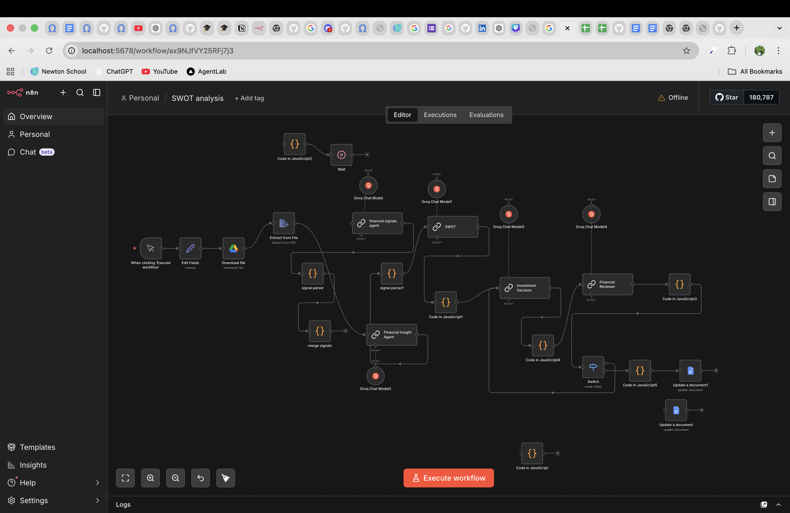

# 🚀 n8n Automation Systems

<p align="center">
  
</p>

<p align="center">
  <b>Building intelligent automation systems that solve real-world problems.</b>
</p>

<p align="center">
  
  
  
  
</p>

---

## 🌟 Overview

Most projects demonstrate features.
This repository demonstrates **systems thinking**.

Each workflow here is designed as a **real, deployable automation pipeline** — combining APIs, AI, and logic to create solutions that are practical, scalable, and impactful.

---

## 🧠 What Makes This Different?

* 🔁 Not scripts → **end-to-end automation systems**
* 🧩 Modular workflows → **easy to extend & reuse**
* 🌐 Webhook-ready → **can be turned into live products**
* ⚡ Built for real-world use cases, not just demos

---

## 🏗️ Architecture

<p align="center">
  
</p>

```text
User → Webhook → n8n → API/AI Processing → Output
```

---

## 📂 Workflows

---

### 📰 Best News Daily Notification

<p align="center">
  
</p>

**Automates curated news delivery.**

* Fetches latest news via APIs
* Filters high-value content
* Sends summarized updates

---

### 📧 Email Summariser

<p align="center">
  
</p>

**Turns long emails into concise insights.**

* Accepts raw email input
* Uses AI for summarization
* Outputs key points instantly

---

### 📄 Research Paper Assistant

<p align="center">
  
</p>

**Simplifies complex research papers.**

* Extracts key ideas
* Breaks down technical content
* Makes information accessible

---

### 📊 SWOT Analysis Generator

<p align="center">
  
</p>

**Generates structured strategic analysis.**



* Input any topic/business
* Outputs SWOT breakdown
* Useful for decision-making
* Sample Output - https://docs.google.com/document/d/10vTmWxExCWurydQwCx4qUcNkhJ8xF3KVbNZw5XjQt8s/edit?usp=sharing
---

### 🎯 Study Plan Customization

<p align="center">
  
</p>

**Creates personalized study plans.**

* Accepts goals & constraints
* Generates optimized roadmap
* Focuses on efficiency

---

## ⚙️ Tech Stack

* 🧠 **n8n** — Workflow automation
* 🐳 **Docker** — Containerized deployment
* 🌐 **APIs** — OpenAI, Email, News
* 🔗 **Webhooks** — System integration

---

## 🚀 Getting Started

### 1. Clone Repository

```bash
git clone https://github.com/abhinavsingh-hub/n8n-workflows.git
cd n8n-workflows
```

---

### 2. Run with Docker

```bash
docker-compose up
```

---

### 3. Open n8n

```
http://localhost:5678
```

---

### 4. Import Workflows

* Go to n8n UI
* Click **Import**
* Upload JSON files from `/workflows`

---

## 🌐 Live Demo

> ⚠️ Hosted on free-tier infrastructure — may take a few seconds to wake up.

👉 *(Add your Render / deployed link here)*

---

## 📸 Workflow Preview

<p align="center">
  
</p>

---

## 🔐 Environment Setup

Create a `.env` file:

```env
N8N_BASIC_AUTH_ACTIVE=true
N8N_BASIC_AUTH_USER=admin
N8N_BASIC_AUTH_PASSWORD=yourpassword
```

---

## 💡 Why This Project Matters

Automation is not about saving time.
It’s about **multiplying impact**.

This repository reflects my focus on:

* Building systems, not just code
* Combining AI with practical workflows
* Creating solutions that can scale

---

## 👤 About Me

**Abhinav Singh**

* 🗣️ International MUN winner and Public Speaker
* 🏢 Co-Founder and President-MAARS International
* 🧠 Tech Enthusiast & Builder
* 🌍 Focused on impact through technology

> “An engineer doesn’t just see the world —
> they see how to make it better.”

---

## ⭐ Support

If you found this valuable:

* ⭐ Star this repository
* 🍴 Fork and build on it
* 🤝 Let’s collaborate

---

<p align="center">
  <b>Built with intent. Designed for impact.</b>
</p>
